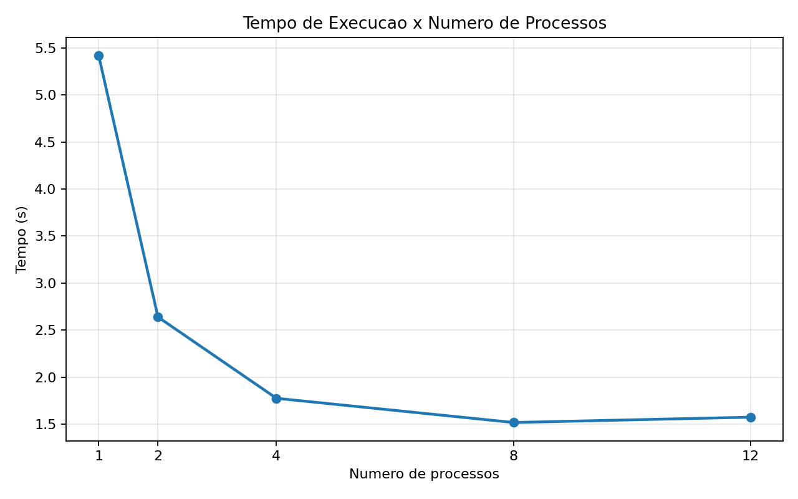
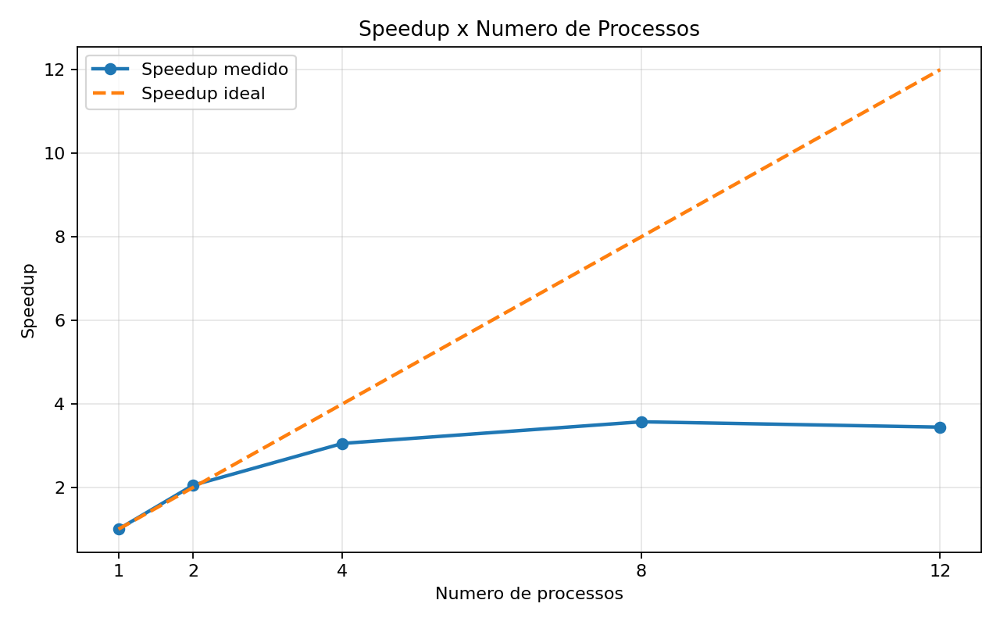
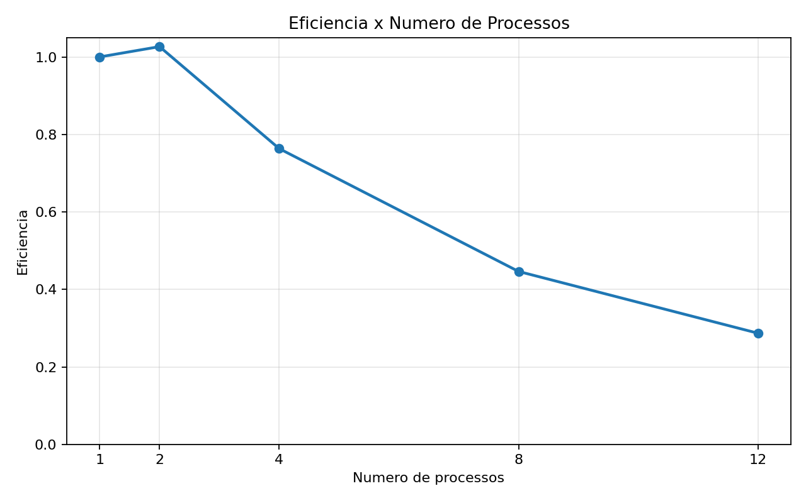

# Relatorio da Atividade 3 - Paralelizacao de Avaliador de Logs

**Disciplina:** Programacao Concorrente e Paralela  
**Aluno(s):** Marcos de Oliveira Campos  
**Turma:** ADS04N1
**Professor:** Rafael Marconi Ramos
**Data:** 25/03/2026

---

# 1. Descricao do Problema

Foi implementado um avaliador de arquivos de log que processa cada arquivo texto e consolida:

- total de linhas
- total de palavras
- total de caracteres
- contagem das palavras-chave erro, warning e info

A versao serial processa os arquivos sequencialmente. A versao paralela foi implementada com modelo produtor-consumidor com buffer limitado, usando processos:

- 1 processo produtor coloca caminhos de arquivos em uma fila com capacidade maxima
- N processos consumidores retiram tarefas da fila e executam a analise de cada arquivo
- os resultados parciais sao consolidados ao final

Objetivo da paralelizacao: reduzir o tempo total de execucao para o mesmo volume de dados.

Volume de dados usado nos testes (pasta log2 desta maquina):

- 25 arquivos
- 250000 linhas no total
- 5000000 palavras no total
- 34170981 caracteres no total

Algoritmo utilizado:

- varredura linear por linha e por palavra
- consolidacao final por soma dos resultados parciais

Complexidade aproximada:

- tempo: O(T), onde T eh o total de tokens/palavras lidos
- espaco: O(P), com P processos ativos e estrutura de consolidacao

---

# 2. Ambiente Experimental

| Item                        | Descricao                                           |
| --------------------------- | --------------------------------------------------- |
| Processador                 | AMD Ryzen 5 7520U with Radeon Graphics              |
| Numero de nucleos           | 4 nucleos fisicos (8 threads logicas)              |
| Memoria RAM                 | 15.28 GB                                            |
| Sistema Operacional         | Microsoft Windows 11 Pro 10.0.26200 64 bits        |
| Linguagem utilizada         | Python                                               |
| Biblioteca de paralelizacao | multiprocessing (biblioteca padrao do Python)      |
| Compilador / Versao         | CPython 3.13.7                                      |

---

# 3. Metodologia de Testes

Os experimentos foram executados com o programa avaliador serial/paralelo em modo benchmark.

Configuracoes testadas:

- 1 processo (serial)
- 2 processos
- 4 processos
- 8 processos
- 12 processos

Procedimento:

- foi realizada 1 execucao para cada configuracao (ultima rodada de medicao)
- o tempo de execucao foi medido internamente pelo programa com time.time()
- como houve 1 execucao por configuracao, o tempo medido coincide com a media
- a entrada foi fixa (pasta log2 desta maquina)
- execucoes feitas em ambiente desktop/notebook normal, sem isolamento exclusivo de carga

---

# 4. Resultados Experimentais

| Nº Threads/Processos | Tempo de Execucao (s) |
| -------------------- | --------------------- |
| 1                    | 5.4185                |
| 2                    | 2.6391                |
| 4                    | 1.7748                |
| 8                    | 1.5175                |
| 12                   | 1.5740                |

---

# 5. Calculo de Speedup e Eficiencia

Speedup:

Speedup(p) = T(1) / T(p)

Eficiencia:

Eficiencia(p) = Speedup(p) / p

Onde:

- T(1) = tempo serial
- T(p) = tempo com p processos
- p = numero de processos

---

# 6. Tabela de Resultados

| Threads/Processos | Tempo (s) | Speedup | Eficiencia |
| ----------------- | --------- | ------- | ---------- |
| 1                 | 5.4185    | 1.0000  | 1.0000     |
| 2                 | 2.6391    | 2.0531  | 1.0266     |
| 4                 | 1.7748    | 3.0530  | 0.7633     |
| 8                 | 1.5175    | 3.5707  | 0.4463     |
| 12                | 1.5740    | 3.4425  | 0.2869     |

---

# 7. Grafico de Tempo de Execucao

---

# 8. Grafico de Speedup

---

# 9. Grafico de Eficiencia

---

# 10. Analise dos Resultados

O speedup nao foi linear, mas houve ganho consistente ate 8 processos. O melhor tempo medido foi com 8 processos (1.5175 s), resultando em speedup 3.5707.

A aplicacao apresentou escalabilidade parcial:

- de 1 para 2 processos: ganho acima do ideal teorico (eficiencia 1.0266), efeito comum de variacao de medicao
- de 2 para 4 processos: ganho ainda relevante
- de 4 para 8 processos: ganho menor, com queda de eficiencia
- de 8 para 12 processos: houve regressao de desempenho

Ponto de queda forte da eficiencia:

- a eficiencia cai progressivamente e fica mais evidente apos 4 processos

Relacao com hardware:

- a maquina possui 4 nucleos fisicos e 8 threads logicas
- 12 processos ultrapassa a capacidade logica, aumentando disputa de CPU e overhead

Principais causas provaveis para perdas e gargalos:

- overhead de criacao e sincronizacao de processos
- comunicacao entre processos via filas
- contencao de CPU quando ha mais processos do que capacidade de execucao simultanea
- custo fixo de coordenacao do produtor-consumidor para um conjunto de apenas 25 arquivos

---

# 11. Conclusao

O paralelismo trouxe ganho significativo de desempenho nesta maquina, reduzindo de 5.4185 s (serial) para 1.5175 s (8 processos), com speedup de 3.5707.

Melhor configuracao observada:

- 8 processos

Escalabilidade:

- boa ate 8 processos
- queda ao usar 12 processos por saturacao e overhead

Melhorias futuras sugeridas:

- ajuste dinamico de quantidade de processos com base nos nucleos disponiveis
- processamento em lotes maiores por tarefa para reduzir overhead de fila
- uso de afinidade de CPU e repeticoes adicionais para analise estatistica mais robusta

---

# Validacao de Corretude

Resultado validado para log1 (esperado no enunciado):

- Total de linhas: 600
- Total de palavras: 12000
- Total de caracteres: 82085
- erro: 1993
- warning: 1998
- info: 1983